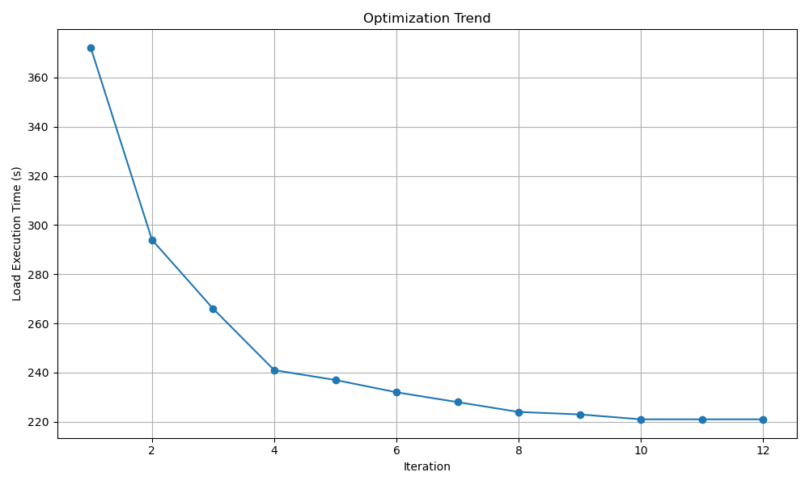

# AQETuner

This repository contains the artifact for the VLDB submitted paper 'AQETuner: Reliable Query-level Configuration Tuning for Analytical Query Engines'. The codebase here is designed to support the research presented in the paper.

## Tuner Setup
First, we need to prepare the execution environment for the Tuner.
```
conda create --name aqetuner python=3.8
conda activate aqetuner
pip install -r requirements.txt
```

## OLAP Engine Setup
Then, we need to set up the environment for our OLAP engine. We will take ByteHouse as an example. Instructions for the deployment of Apache Presto can be provided upon request.

In the following steps, we assume that both the OLAP engine and the Tuner are deployed on the same machine. However, it's important to note that the OLAP engine and Tuner components can be deployed on physically separate machines, as long as there is network connectivity between them.
### ByteHouse Setup

[ByteHouse](https://github.com/ByConity/ByConity) is ByteDance's proprietary data warehouse solution, designed to enable petabyte-scale SQL-based analytics. 
Below are the deployment steps for Debian/Ubuntu systems:

1.install necessary packages for building ByteHouse:

```
sudo apt-get update
sudo apt-get install git cmake ccache python3 ninja-build libssl-dev libsnappy-dev apt-transport-https

# install llvm 12
sudo apt install lsb-release wget software-properties-common gnupg # pre-requisites of llvm.sh
wget https://apt.llvm.org/llvm.sh
chmod +x llvm.sh
sudo ./llvm.sh 12
```

2.Download source code and build ByteHouse:

```
git clone --recursive https://github.com/ByConity/ByConity.git
cd ByConity
mkdir build && cd build
export CC=clang-12
export CXX=clang++-12
cmake ..
ninja
```

Upon successful completion of the build process, the compiled binary executable will be located in the `programs` folder:

```
clickhouse-client    # byconity client
clickhouse-server    # byconity server
clickhouse-worker    # byconity worker
tso_server           # byconity tso
daemon_manager       # byconity daemon manager
resource_manager     # byconity resource manager
```

3.Then, we start a ByteHouse instance with the example configuration files in `bytehouse_conf` folder:

```
bash scripts/run_bytehouse.sh
```


<!-- This repo mainly targets on tuning ByteHouse(https://github.com/ByConity/ByConity). You can follow the official guide(https://github.com/ByConity/ByConity#build-and-run-byconity) to establish a ByteHouse instance.


Bonus: The `fixed_config.json` file contains the fixed configurations of the database, such as the dialect that the database should use. If you have configured specific user credentials and a password, they also need to be specified in this file. -->


### Data import 

We will show how to import data into ByteHouse using the TPC-DS dataset as an example.

1.First, create TPC-DS tables. The parameters `-h` and `--port` specify the host and port of your ByteHouse instance respectively. The schema files for [JOB](https://github.com/gregrahn/join-order-benchmark) and [STATS](https://github.com/Nathaniel-Han/End-to-End-CardEst-Benchmark) can be provided upon request.

```
clickhouse-client -m -h 127.0.0.1 --port 6669 --query 'create database tpcds'
clickhouse-client -m -h 127.0.0.1 --port 6669 --database tpcds --multiquery < workloads/tpcds_sql_create_table.sql
```

2.Build `dsdgen`:

```
git clone https://github.com/gregrahn/tpcds-kit.git
cd tpcds-kit/tools
make
```

3.Then, generate the data with the parameter `-scale` to specify the scale factor. Of course, you can try large scale dataset.

```
./dsdgen -scale 1
```

4.Import the *.dat data files into ByteHouse:

```
bash scripts/tpcds_import_bh.sh
```

5.After importing data files, create statistics information for ByteHouse's query optimizer:

```
clickhouse-client -m -h 127.0.0.1 --port 6669 --database tpcds --query 'create stats all'
```


<!-- ## End-to-end Tuning -->

<!-- To conduct tuning for ByteHouse instance, please first specify the database connection host and port in `run.sh` in following formats:

```
export DB=tpcds
export DB_HOST=http://localhost:8123
```

Then, just execute the script:

```
bash run.sh
``` -->

## Configuration Tuning

First, we specify how to access the OLAP engine using `export` command:

```
export DB_HOST=http://localhost:8123
```

### Warm Starter

We execute the warm-starter process to collect high-quality initial samples:
```
python pso.py --knob_file tuned_knobs.json \
            --db tpcds --sqls workloads/tpcds \
            --output data/tpcds_pso_samples \
            --threads 1
```

`--knob_file` is used to specify the target tuning knobs. The `tuned_knobs.json` file contains the knobs that require tuning. 

`--db` specifies the target database in the OLAP engine.

`--threads` controls the parallism level of pso sampling. 

`--sqls` is used to specify the target tuning workloads. Each line within the file designated by this option corresponds to an individual SQL query.  

`--output` specifies the file to which the sample data is written.

### Training Knob-Plan Encoder & Dual-Task Predictor

Train the Knob-Plan Encoder and Dual-Task Predictor using the following command. Our implementation of the Neural Process is based on the Attentive Neural Process from the repository [ANP](https://github.com/soobinseo/Attentive-Neural-Process).

```
python train.py --sample_file data/tpcds_pso_sample \ 
            --model_output checkpoints/tpcds_model.tar \
            --epoch 5 \
            --lr 0.0005
```

`--sample_file` is used to specify the file that holds the sampled data.

`--model_output` specifies the path where the trained model will be saved.

`--epoch` is used to set the number of training epochs.

`--lr`  is used to specify the learning rate for the training process.

### Configuration Tuning

With the trained encoder and predictor, we can start tuning the target workload with the following command:

```
python tune.py --knob_file tuned_knobs.json \
                --sample_file data/tpcds_pso_sample \
                --db tpcds --sqls workloads/tpcds \
                --model checkpoints/tpcds_model.tar \
                --max_iteration 50 \
                --result_file tune_tpcds.log
```

`--model` specifies the path of model file, which corresponds to `--model_output` of the training phase.

`--max_iteration` specifies the maximum number of iterations for the tuning process.

`--result_file` specifies the file where performance information will be output.

#### Performance Evaluation
We can monitor the performance trend of the target workload using our provided script and referring to the `tune_tpcds.log` file. The following command is used: 
```
python visualize.py --input tune_tpcds.log
```

For the TPC-DS 10G workload, its performance trend is presented in the plot below:


